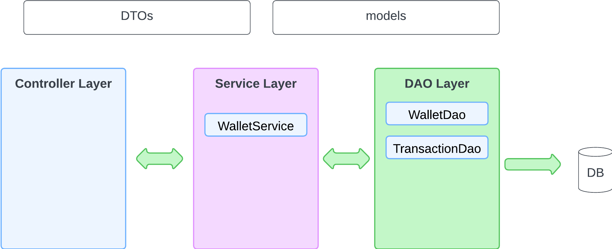

# 💰 Wallet App - Spring IoC + DI + Business Logic Demo

**Wallet App** simulates a basic financial system where users can create wallets, deposit or withdraw funds, and automatically track each transaction. It provides a simple yet realistic scenario to demonstrate how layered architecture and core concepts like IoC and Dependency Injection work together in a real Java application.

This is a simple yet powerful Wallet Application built with **Java** and the **Spring Framework**, designed as an educational project to demonstrate core concepts like:

- Business logic separation
- Dependency injection (DI)
- Inversion of control (IoC)
- Layered architecture (DAO, Service)
- Clean code design

---

## 🧩 What This App Can Do

This Wallet App allows you to:
- ✅ Create a new wallet for a user
- 💵 Deposit money into a wallet
- 🧾 Withdraw money from a wallet
- 📜 Automatically record transactions for each operation
- 🕵️‍♂️ Retrieve wallet details and transaction history
- 🧪 Practice writing clean, testable, and modular Java code
- 
---

## 🌟 What is Multilayered Architecture?

Multilayered (or layered) architecture separates your application into logical layers.  
This keeps your code **organized**, **reusable**, and **easier to maintain**.

In a typical **Spring EE app**, we often use these 3 main layers:

---

## 🧱 1. Controller Layer (aka Web Layer or Presentation Layer)

- Handles **HTTP requests** (like from a browser or API client).
- Talks to the **Service layer**.
- Returns **views** (for web apps) or **JSON/XML** (for REST APIs).

---

## ⚙️ 2. Service Layer (aka Business Logic Layer)

- Contains your **business rules** or logic.
- Coordinates data between the **Controller** and **DAO** layers.
- Ensures **transactions**, **validations**, etc.

---

## 🗃️ 3. DAO Layer (aka Repository or Data Access Layer)

- Talks to the **database**.
- Handles **CRUD operations** (Create, Read, Update, Delete).
- Usually interfaces extending Spring Data JPA’s `JpaRepository`.

### IoC & DI
- Objects like `WalletDao` and `TransactionService` are injected automatically by Spring using `@Autowired`.
- You never write `new WalletDao()` — Spring does it for you.